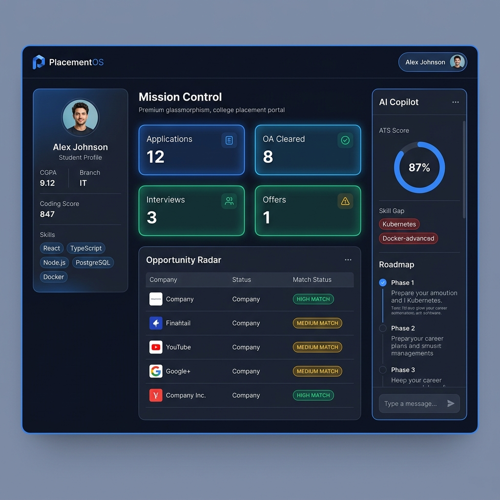
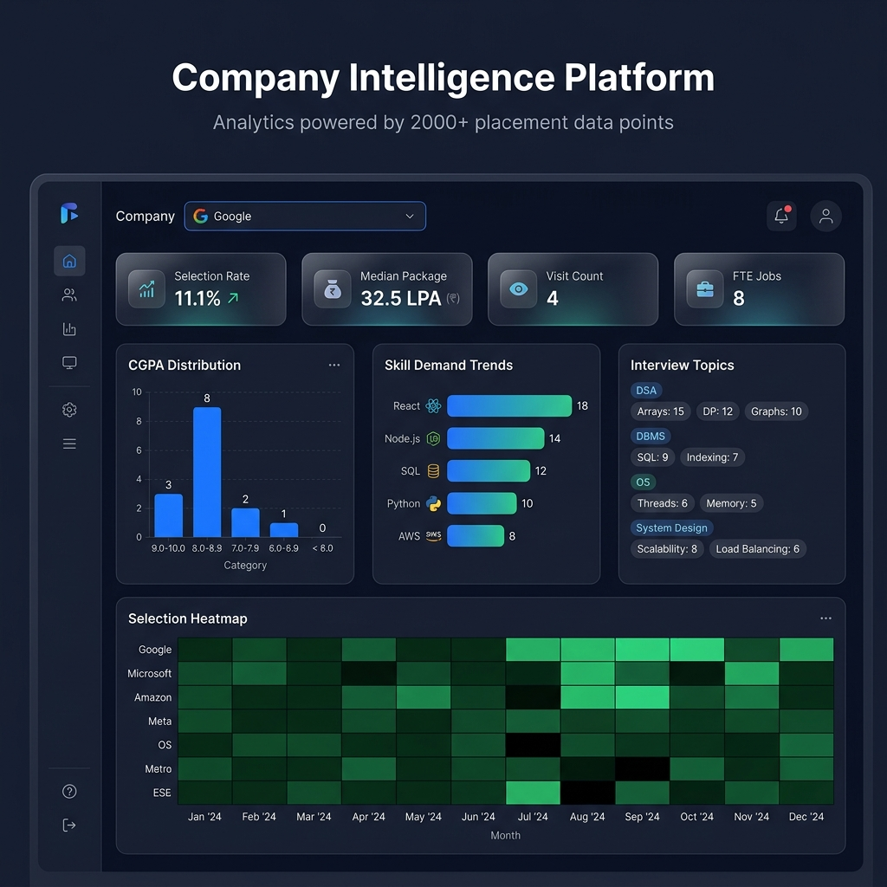
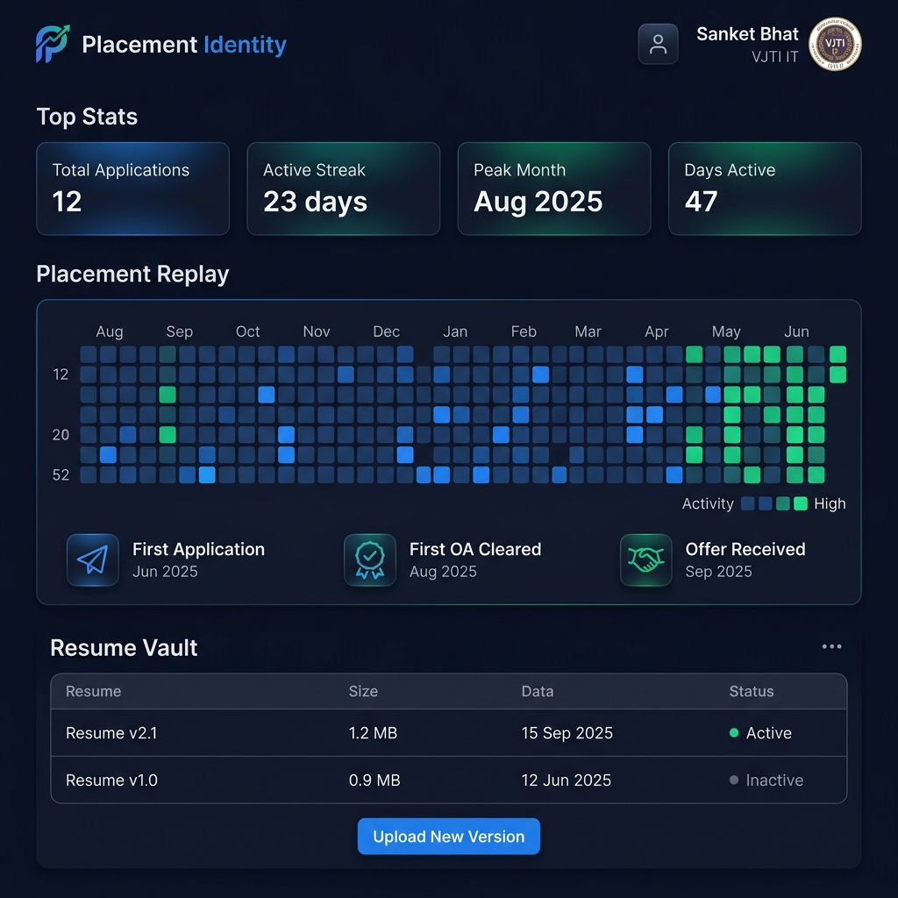

# PlacementOS

> **Enterprise-grade campus placement portal**
> Multi-tenant · RBAC · AI Intelligence · Resume Management · Company Analytics

[](src/lib/__tests__)
[](#)
[](https://www.typescriptlang.org/)
[](https://nextjs.org/)
[](https://www.prisma.io/)
[](#)

---

## Screenshots

### Mission Control Dashboard


### Company Intelligence Platform


### Placement Identity & Resume Vault


---

## Architecture

```
┌─────────────────────────────────────────────────────────┐
│                 Browser (Next.js 15 App)                 │
│       Mission Control · Company Intel · Identity         │
└────────────────────────────┬────────────────────────────┘
                             │ HTTPS
                             ▼
┌─────────────────────────────────────────────────────────┐
│                  Next.js Middleware (Edge)               │
│         Rate Limiting · CSRF · Secure Headers            │
└────────────────────────────┬────────────────────────────┘
                             │
              ┌──────────────┴──────────────┐
              ▼                             ▼
┌─────────────────────┐      ┌─────────────────────────┐
│   REST API Routes   │      │   BullMQ Worker          │
│  (JWT · RBAC · Zod) │      │  (5 AI job handlers)     │
└─────────┬───────────┘      └────────────┬────────────┘
          │                               │
          ▼                               ▼
┌─────────────────────┐      ┌─────────────────────────┐
│  Repository Pattern │      │   FastAPI AI Service     │
│  (Prisma ORM)       │      │   (Python 3.11)          │
└─────────┬───────────┘      └────────────┬────────────┘
          │                               │
          ▼                               ▼
┌─────────────────────┐      ┌─────────────────────────┐
│    PostgreSQL        │      │       ChromaDB           │
│  (Primary Store)     │      │   (Vector Store / RAG)  │
└─────────────────────┘      └─────────────────────────┘
          ▲
          │
┌─────────────────────┐
│       Redis          │
│  (Cache · BullMQ)   │
└─────────────────────┘
```

---

## Features

### ✅ Sprint 1 — Multi-Tenant Foundation
- HttpOnly JWT authentication with Refresh Token Rotation (RTR) replay detection
- Argon2id password hashing via WebAssembly (`hash-wasm`)
- AES-256-GCM encryption for PII fields (phone, personal email)
- Multi-tenant PostgreSQL schema — every record carries `tenantId`
- Dependency Injection Container (`container.ts`)

### ✅ Sprint 2 — Infrastructure
- Structured JSON request logger (requestId, IP, latency, user-agent)
- BullMQ job queue with exponential backoff and Dead Letter Queue
- Redis `cacheManager` with TTL, get, set, delete, pattern eviction
- Health/live/ready/version API endpoints

### ✅ Sprint 3 — Core APIs & Company Battle
- `GET /api/v1/jobs` — Opportunity Radar (HIGH/MEDIUM/LOW match scoring)
- `GET /api/v1/company-battle` — Side-by-side company comparison with Redis cache
- `POST /api/v1/applications` — CGPA cutoff validation + duplicate prevention
- Full RBAC: STUDENT · TPO · RECRUITER · ALUMNI

### ✅ Sprint 4 — Mission Control UI
- Bloomberg/Linear-style dashboard with Ctrl+K Command Palette
- Placement Timeline Engine (APPLIED → OA_CLEARED → INTERVIEW_ROUND → SELECTED)
- Opportunity Radar job matcher with live match scoring
- Company Battle V2 comparator panel

### ✅ Sprint 5 — Backend Hardening
- Token bucket rate limiting: GUEST 30/min · STUDENT 100/min · TPO 300/min
- Zod validation on every request body
- CSRF origin/host header verification on all mutations
- Composite database indexes for all high-read queries
- Audit logs on every state-changing operation

### ✅ Sprint 6 — Resume Management
- Multi-version resume upload (PDF/DOCX, max 10MB)
- Binary-level document validation: magic number headers, MZ executable scan, PDF script scan, DOCX ZIP structure scan
- SHA-256 deduplication hash
- Resume version history, activation, and soft deletion
- Binary streaming download with `Content-Type` and `Content-Disposition` headers
- Skill auto-sync to student profile on upload/activation

### ✅ Sprint 7 — Company Intelligence
- `AnalyticsService` — 7 computation methods (zero AI dependencies)
- Selection rate, median package (in-process), FTE/Intern split, CGPA buckets, branch breakdown
- Skill demand trends (7 tracked technologies)
- Interview topic frequency by category (DSA/DBMS/OS/System Design)
- Selection density heatmap (month × company)
- Placement calendar (`PlacementEvent` table)
- Global search across 5 entities — powers Ctrl+K palette

### ✅ Sprint 8 — AI Intelligence Layer
- **Resume ATS Scoring** — keyword match + section completeness, 0–98 score
- **Skill Gap Analysis** — current skills vs target role requirements
- **Learning Roadmap** — phased plan scaled to available weeks
- **Interview Vault RAG** — ChromaDB semantic search over past interview questions
- **Placement Copilot** — pattern-matched placement Q&A with student context enrichment
- All AI calls via **BullMQ queue** → FastAPI → result stored in `AIResult` table → frontend polls

---

## Tech Stack

| Layer | Technology | Why |
|---|---|---|
| Frontend | Next.js 15, React 19, TypeScript | App Router, SSR, monorepo colocation |
| Styling | Tailwind CSS v4, Framer Motion | Utility-first, animations |
| Auth | JWT + Argon2id + AES-256-GCM | Secure, standard, no magic |
| Database | PostgreSQL + Prisma v6 | ACID, type-safe, composite indexes |
| Cache | Redis (ioredis) | Sub-ms reads, BullMQ backend |
| Queue | BullMQ | Reliable jobs, DLQ, exponential backoff |
| AI Service | FastAPI (Python 3.11) | Async, type-checked, no GPU needed |
| Vector Store | ChromaDB + all-MiniLM-L6-v2 | Local-first RAG, no OpenAI dependency |
| Validation | Zod v4 | Runtime type-safe schema validation |
| Testing | Jest + ts-jest | 59 tests, zero-DB mocking |
| Deployment | Vercel + Neon + Upstash + Railway | Serverless-first, auto-scaling |

---

## Local Setup

### Prerequisites
- Node.js 20+
- Docker Desktop
- Python 3.11+ (for AI service)

### 1. Clone
```bash
git clone https://github.com/YOUR_USERNAME/placement-os.git
cd placement-os
```

### 2. Install Dependencies
```bash
npm install
```

### 3. Configure Environment
```bash
cp .env.example .env
# Edit .env with your values
```

### 4. Start Infrastructure
```bash
docker-compose up -d
```

### 5. Initialize Database
```bash
npx prisma migrate dev --name init
npx prisma generate
```

### 6. Seed Demo Data (300 students, 100 companies, 2000 applications)
```bash
npm run seed
```

### 7. Start AI Service (optional)
```bash
cd ai-service
pip install -r requirements.txt
uvicorn main:app --reload --port 8000
```

### 8. Start Next.js
```bash
npm run dev
```

Visit `http://localhost:3000`

---

## Docker Setup (Full Stack)

Run the entire stack with one command:
```bash
docker-compose up --build
```

This starts:
- PostgreSQL (port 5432)
- Redis (port 6379)
- ChromaDB (port 8001)
- FastAPI AI Service (port 8000)

Then in a separate terminal:
```bash
npx prisma migrate dev --name init && npm run seed && npm run dev
```

---

## API Documentation

Full API reference with request/response examples: [docs/api.md](docs/api.md)

### Quick Reference

| Method | Endpoint | Description |
|---|---|---|
| POST | `/api/auth/register` | Student registration |
| POST | `/api/auth/login` | Login → HttpOnly cookies |
| POST | `/api/auth/refresh` | Token rotation (RTR) |
| GET | `/api/v1/jobs` | Jobs + Opportunity Radar |
| GET | `/api/v1/company-battle` | Company comparator |
| POST | `/api/v1/resume` | Upload resume (multipart) |
| GET | `/api/v1/company/stats` | Recruiter statistics |
| GET | `/api/v1/company/search` | Global keyword search |
| POST | `/api/v1/ai/analyze-resume` | ATS analysis (async) |
| POST | `/api/v1/ai/vault-rag` | Interview vault RAG |
| POST | `/api/v1/ai/copilot` | Placement Q&A |

---

## Security

- **JWT**: Access tokens expire in 15 minutes. Signed HS256 with a 32-char secret.
- **Refresh Token Rotation (RTR)**: Every refresh rotates the token. Replay detection triggers full session invalidation.
- **RBAC**: Four roles (STUDENT, TPO, RECRUITER, ALUMNI) enforced at API route level.
- **Tenant Isolation**: `tenantId` is embedded in JWT. Every DB query filters by `tenantId`. Cross-tenant access is cryptographically impossible.
- **CSRF**: Origin + Host header verification on all POST/PUT/DELETE/PATCH.
- **Rate Limiting**: Token bucket in Next.js middleware — GUEST 30/min, STUDENT 100/min, TPO 300/min.
- **File Upload**: Magic number validation, executable header scan, PDF script tag scan, DOCX ZIP structure verification.
- **Audit Logs**: All state-changing operations logged with actor, IP, user-agent, and timestamp.

---

## AI Pipeline

```
User submits question/resume via browser
          ↓
Next.js API Route (authenticates, validates with Zod)
          ↓
addBackgroundJob('ai:resume-analyze', payload)  ← BullMQ
          ↓
Returns 202 Accepted + jobId
          ↓
BullMQ Worker picks up job
          ↓
Calls FastAPI: POST http://localhost:8000/analyze-resume
          ↓
FastAPI: keyword analysis + ChromaDB RAG context (if available)
          ↓
Result stored in AIResult table (status: DONE)
          ↓
Browser polls GET /api/v1/ai/analyze-resume?jobId=xxx
          ↓
Returns { status: 'DONE', result: { ats_score, feedback, ... } }
```

**No AI calls from the browser. Ever.**

---

## Deployment

### Next.js → Vercel
```bash
npm i -g vercel
vercel login
vercel --prod
```
Set environment variables in Vercel dashboard from `.env.example`.

### PostgreSQL → Neon
```bash
# Create project at neon.tech
# Copy connection string to DATABASE_URL in Vercel env vars
npx prisma migrate deploy
```

### Redis → Upstash
```bash
# Create database at upstash.com
# Copy Redis URL (TLS) to REDIS_URL in Vercel env vars
```

### AI Service → Railway
```bash
npm i -g @railway/cli
railway login
cd ai-service
railway up
# Set CHROMA_HOST env var to your ChromaDB deployment URL
```

---

## ERD

See [docs/ERD.png](docs/ERD.png) for the full entity-relationship diagram.

**Key models**: `Tenant` → `Student` → `Application` → `Job` → `Company`  
**Sprint 6**: `Resume` (versioned, binary bytea)  
**Sprint 7**: `PlacementEvent`, `JobType` enum  
**Sprint 8**: `AIResult` (async job tracking)

---

## Testing

```bash
npm run test
```

**59 tests** across 9 suites:
- Crypto (Argon2id, AES-256-GCM)
- PDF/Document Validation
- Redis Cache
- BullMQ Queues
- Integration (tenant isolation, company battle math)
- API Security (auth, RBAC, rate limit)
- Resume (upload, validation, versioning)
- Analytics (7 computation methods)
- AI Layer (repository, worker, mock client)

---

## Architecture & Design Docs

| Document | Description |
|---|---|
| [architecture.md](docs/architecture.md) | Full system architecture with Mermaid diagrams |
| [api.md](docs/api.md) | All 24 API endpoints with request/response examples |
| [database.md](docs/database.md) | Schema models, indexes, Redis caching strategy |
| [runbook.md](docs/runbook.md) | Setup, migration, troubleshooting, and ops guide |
| [viva-prep.md](docs/viva-prep.md) | 13 technical Q&As for interviews and vivas |

---

]
