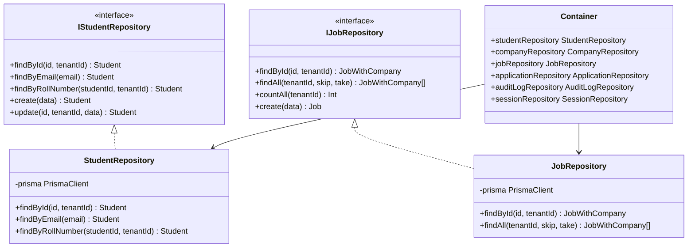
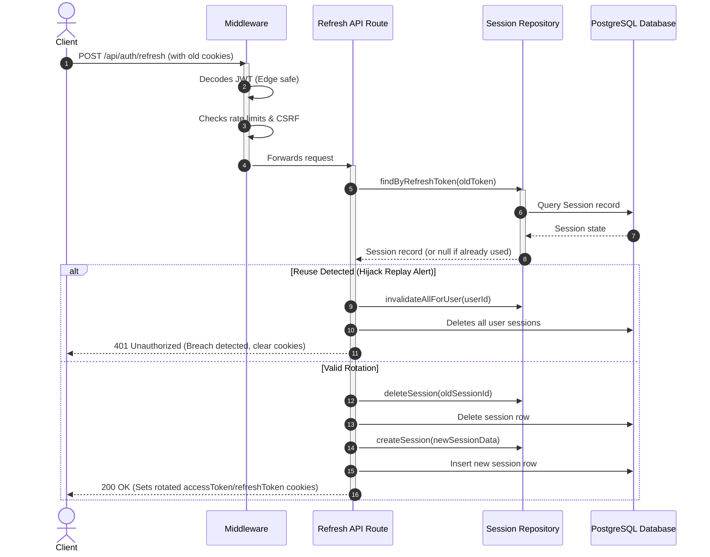
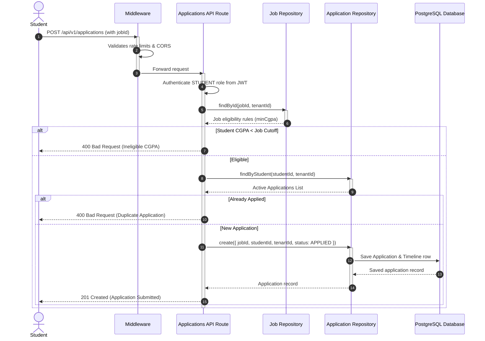
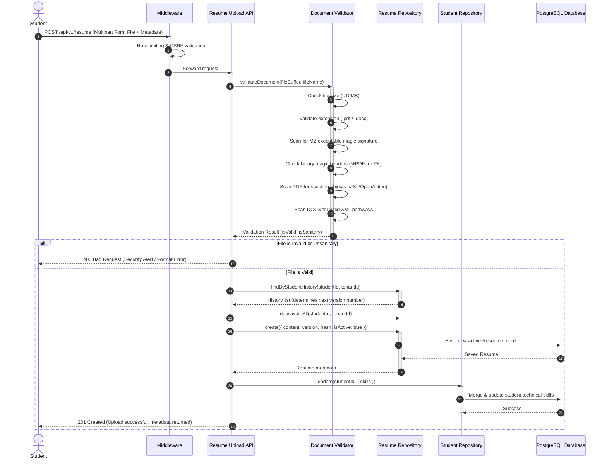

# PlacementOS System Architecture

This document outlines the software architecture of VJTI's Placement Operating System (PlacementOS), a multi-tenant enterprise placement portal.

## Technology Stack

PlacementOS is designed with a premium, high-availability architecture using the following stack:
1. **Frontend Framework**: Next.js 15.5 with App Router (React 19, TypeScript)
2. **Styling**: Tailwind CSS v4
3. **Database Layer**: Prisma Client (v6) interfacing with PostgreSQL
4. **Caching & Queue Layer**: Redis (powered by `ioredis`) for analytics caching
5. **Background Workers**: BullMQ for distributed background jobs (e.g. resume processing, notification logs)
6. **Authentication & Crypto**: JSON Web Tokens (JWT) using Argon2id hashing via WebAssembly (`hash-wasm`) and AES-256-GCM symmetric encryption

---

## Architectural Layers

```
┌─────────────────────────────────────────────────────────┐
│                     Client Dashboard                    │
│             (Home UI, Cmd+K Palette, Battle)            │
└────────────────────────────┬────────────────────────────┘
                             │
                             ▼
┌─────────────────────────────────────────────────────────┐
│                   Next.js Middleware                    │
│        (Secure Headers, Rate Limiter, CSRF Check)        │
└────────────────────────────┬────────────────────────────┘
                             │
                             ▼
┌─────────────────────────────────────────────────────────┐
│                   REST API Controllers                  │
│          (JWT Verification, Role RBAC Gating)           │
└────────────────────────────┬────────────────────────────┘
                             │
                             ▼
┌─────────────────────────────────────────────────────────┐
│                    Repository Pattern                   │
│            (Database Queries, Tenant Filters)           │
└────────────────────────────┬────────────────────────────┘
                             │
                             ▼
┌────────────────────────────┴────────────────────────────┐
│                    Database & Cache                     │
│                  (PostgreSQL & Redis)                   │
└─────────────────────────────────────────────────────────┘
```

---

## Multi-Tenant Architecture & Isolation

PlacementOS operates on a single-database, shared-schema multi-tenant design:
1. **Tenant Identification**: Every institutional client (e.g., VJTI Main Campus, VJTI PG Division) is represented by a unique `Tenant` ID record.
2. **Context Association**: All primary entities (`Student`, `Company`, `Job`, `Application`, `AuditLog`, `Session`) explicitly reference `tenantId`.
3. **Cryptographic Validation**: When a user logs in, their validated `tenantId` is signed directly into their HttpOnly `accessToken`.
4. **Data Isolation Filters**: The repository layer rejects or overrides client-supplied `tenantId` fields, strictly querying filters using `where: { tenantId: payload.tenantId }`. Cross-tenant record fetching is programmatically impossible.

---

## Security System

1. **Authentication Flow**: Uses a dual-token setup (`accessToken` expiring in 15 minutes, `refreshToken` expiring in 7 days).
2. **Refresh Token Rotation (RTR)**: Upon token refresh requests, the system rotates the refresh token. If a previously rotated token is presented again (indicating hijack replay), the system triggers reuse detection, invalidates all sessions for that user, audit-logs the breach, and forces re-authentication.
3. **Rate Limiting**: Custom token bucket rate limiting in middleware enforces API request quotas:
   - **GUEST**: 30 requests/minute
   - **STUDENT**: 100 requests/minute
   - **TPO/RECRUITER**: 300 requests/minute
4. **Secure Headers**: Sets strict protection headers (`X-Frame-Options: DENY`, `X-Content-Type-Options: nosniff`, and a rigid CSP policy).
5. **CSRF Protection**: Origin and host headers are cross-verified for all mutating request types (POST, PUT, DELETE, PATCH).

---

## Event-Driven Task Queuing

Background processing is delegated asynchronously:
1. **BullMQ Queues**: Jobs such as `resume:analyze` and `email:send` are enqueued with a standard delay backoff.
2. **Retry Strategy**: Failed jobs retry up to 3 times with exponential backoff:
   $$\text{Delay} = 2^{\text{retryCount}} \times 1000\,\text{ms}$$
3. **Dead Letter Queue (DLQ)**: Jobs that fail after 3 retries are written to the `placement-tasks-dlq` queue for manual administration.

---

## System Diagrams (Mermaid UML)

### 1. Repository Pattern Class Diagram


### 2. Refresh Token Rotation (RTR) Sequence Diagram


### 3. Application Progression Sequence Diagram


---

## Resume Validation & Sanitization Engine

PlacementOS deploys a binary-level document validation and security scanner to ensure that student resumes are safe for recruiter view and application submittals.

1. **Size Verification**: Restricts files to a hard limit of `10MB`.
2. **Strict Extension Constraints**: Rejects everything except `.pdf` and `.docx`.
3. **Executable Headers Scan**: Checks the first two bytes of files for the `MZ` signature (`0x4D 0x5A`), preventing renaming executables or scripts to bypass extension security filters.
4. **Header Magic Signatures**:
   - **PDFs**: Rejects uploads if the document prefix doesn't match `%PDF-` bytes (`0x25 0x50 0x44 0x46 0x2d`).
   - **DOCX**: Rejects uploads if they lack the standard ZIP magic prefix `PK` (`0x50 0x4B 0x03 0x04`).
5. **Active Scripting Scan**:
   - **PDF Exploits**: Scans the binary contents for unsafe interactive tags, specifically blocking `/JS`, `/JavaScript`, `/AA` (additional auto-execute actions), and `/OpenAction` objects.
   - **DOCX Archive Spoofing**: Scans raw ZIP headers to ensure standard Word structures exist (expects `[Content_Types].xml` and `word/document.xml` paths). This blocks malicious users from uploading arbitrary ZIP files renamed as `.docx`.
6. **Data Synchronicity**: Upon successful upload or version activation, the engine automatically propagates extracted technical skills directly back to the student profile record in PostgreSQL, ensuring candidate search indexes remain live and up-to-date.

### Resume Upload & Validation Sequence Diagram



---

## Sprint 7 — Company Intelligence Platform

### Analytics Engine (`AnalyticsService`)

The `AnalyticsService` in `src/lib/services/analytics.service.ts` is a pure-TypeScript statistical computation layer with **zero AI dependencies**. It uses relational Prisma queries with tenant-isolated `where` clauses to compute all metrics server-side.

#### Computation Methods

| Method | Description |
|---|---|
| `getCompanyStats(companyId, tenantId)` | Selection rate, median package, FTE/Intern split, CGPA buckets (9+, 8–9, 7–8, <7), branch-wise selection breakdown. |
| `getSkillTrends(tenantId)` | Counts of 7 tracked skills (React, Node.js, SQL, AWS, Java, Python, Docker) across all active resumes in the tenant. |
| `getPackageDistribution(tenantId)` | Min/max/median/count salary stats per company, sorted by median descending. |
| `getInterviewTopics(companyId, tenantId)` | Groups `InterviewVault` entries by category (DSA / DBMS / OS / System Design), sorted by frequency. |
| `getSelectionHeatmap(tenantId)` | Returns month × company selection count matrix for heatmap visualization. |
| `getCalendarEvents(tenantId, month?)` | Queries `PlacementEvent` table for time-boxed institutional events. |
| `globalSearch(query, tenantId)` | Case-insensitive `contains` search across 5 entities (companies, jobs, students, questions, resumes). |

#### Median Calculation
Package medians are computed in-process using sorted arrays — no SQL `PERCENTILE_CONT` required:
```typescript
function median(arr: number[]): number {
  const sorted = [...arr].sort((a, b) => a - b);
  const mid = Math.floor(sorted.length / 2);
  return sorted.length % 2 !== 0
    ? sorted[mid]
    : (sorted[mid - 1] + sorted[mid]) / 2;
}
```

### Placement Replay (GitHub-style Contribution Grid)

The `PlacementIdentity` page (`/identity`) renders a **364-day activity grid** — a GitHub-style contribution heatmap of placement milestones:

- **Data Source**: `PlacementEvent` and `Application` records, bucketed by date.
- **Cell Intensity**: 0–4 activity levels mapped to CSS color intensity classes.
- **Milestone Overlays**: Key events (first application, first offer, placement confirmed) are pinned on the timeline as badges.
- **Summary Stats**: Total events, active streak, peak month, and total days active are computed client-side.

### Global Search Architecture

The `/api/v1/company/search` endpoint powers the Ctrl+K **Command Palette** with a unified, tenant-isolated search:

```
Query → AnalyticsService.globalSearch()
          ├── prisma.company.findMany({ where: { name: contains(q), tenantId } })
          ├── prisma.job.findMany({ where: { title: contains(q), tenantId } })
          ├── prisma.student.findMany({ where: { name: contains(q), tenantId } })
          ├── prisma.interviewVault.findMany({ where: { topic: contains(q), tenantId } })
          └── prisma.resume.findMany({ where: { filename: contains(q), tenantId } })
                                           ↓
                              Merged { companies, jobs, students, questions, resumes }
```

Each sub-query uses Prisma's `mode: 'insensitive'` for case-insensitive matching and is strictly scoped to `tenantId`.

### `PlacementEventRepository`

A dedicated repository (`src/lib/repositories/placement-event.repository.ts`) manages all `PlacementEvent` CRUD:
- `findByTenant(tenantId, month?)` — Returns events with optional month filter.
- `create(data)` — Creates a new placement event record.
- `findByCompany(companyId, tenantId)` — Returns all events for a specific company.

